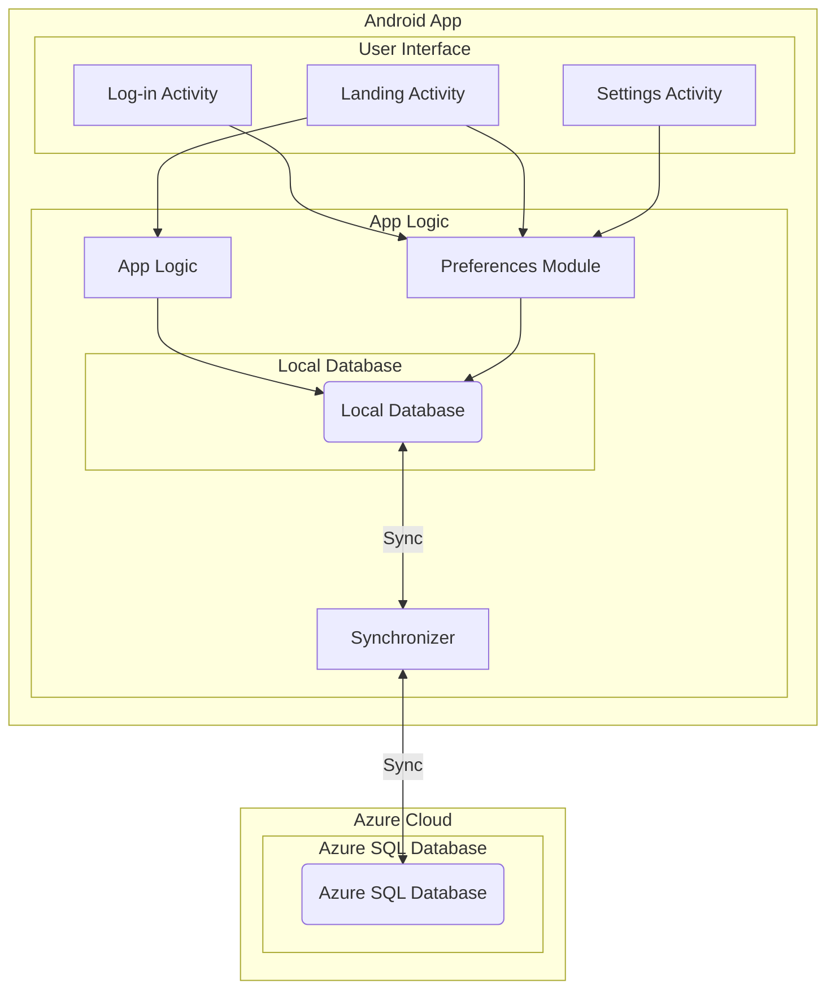

# The Y App

## Simplifying Social Media for Gen Z and Millennials

## Executive Summary:

Provide a concise overview of your social media app concept.
Highlight the unique selling points and the problem it aims to solve.
Mention your team's qualifications and why you're the right team to execute this project.

## Problem Statement:

In our contemporary, interconnected world, X has ascended to prominence as a formidable internet town square for fostering global communication and the rapid dissemination of information. Yet, despite its impressive reach and potential, X confronts a series of formidable challenges that cast shadows over its noble mission to nurture and sustain healthy public discourse and engagement.

The triad of toxicity, harassment, and the relentless spread of misinformation continues to mar its otherwise promising landscape. The situation has grown more complex since the acquisition of X by the tech billionaire Elon Musk, whose leadership has been marked by an increased opacity in the platform's operations and a slew of monetization hurdles, ultimately resulting in the painful exodus of many dedicated former employees.

Amid this tumultuous backdrop, a beacon of hope and innovation emerges in the form of Y. Y was not just born out of necessity; it was conceived as a vision, a bold response to the vexing challenges that have besieged X. Y embodies a refreshing ethos of humility and practicality, a stark departure from the opulence often associated with tech giants. Developed by a group of exceptionally talented and down-to-earth students hailing from the prestigious Red River College Polytechnic, Y represents a new paradigm for social platforms.

One of Y's most remarkable features is its automatic content moderation system, designed with a keen understanding of the urgent need to curb toxicity and maintain a safe, respectful digital environment. Unlike its counterparts, Y doesn't aspire to be a behemoth driven solely by profit; instead, it aspires to foster genuine connections, meaningful discussions, and a sense of community among its users.

In an era when the very fabric of online discourse seems to be unraveling, Y emerges as a refreshing antidote, offering a glimmer of hope for a more civil and productive digital world. Its humble origins and steadfast commitment to become a compelling alternative will calm the turbulent landscape of social media. As we navigate the evolving dynamics of mobile development, Y stands as a promise to deliver ingenuity, purpose, and the determination to shape a better future for online conversations.

## Market Analysis:

Y's strategic vision is firmly rooted in catering to a specific target audience: Gen Z and millennials who crave simplicity in their digital lives. This generation, known for its tech-savviness and preference for streamlined experiences, presents a significant market opportunity for Y.

Gen Z and millennials constitute a substantial portion of the global population, with their preferences and habits significantly shaping the digital landscape. This demographic cohort is characterized by a desire for user-friendly, uncluttered technology solutions that seamlessly integrate into their daily lives.

Y's automatic content moderation and commitment to fostering respectful digital environments directly address the concerns of Gen Z and millennials. The platform's dedication to promoting healthy public discourse and engagement distinguishes it from competitors that may prioritize monetization over user experience.

The competitive advantage of Y's development is down-to-earth students at Red River and this undeniably contributes to its authentic and relatable image. This contrasts with more corporate or profit-driven social media giants, positioning Y as a refreshing alternative for those who want to align themselves with a brand that mirrors their values.

While Y's focus on simplicity is a compelling selling point, it also presents a challenge in a market saturated with diverse, feature-rich social media options. Y must continually innovate to maintain its appeal and relevance to its target audience while ensuring that its commitment to simplicity remains unwavering.

## Product Description:

In an era of complex and cluttered social media platforms, Y emerges as a breath of fresh air, purpose-built for the tech-savvy and discerning Gen Z and millennial generations. Our mission is clear: to provide simplicity in the digital age, offering a haven of streamlined, respectful online interaction for those who seek a genuine, user-centric experience.

#### Key Features:

**Automatic Content Moderation:** Y takes a proactive stance against toxicity and harassment. Our platform employs cutting-edge automatic content moderation tools to ensure a safe and respectful environment, allowing you to focus on meaningful connections.

**User-Friendly Interface:** We understand the value of simplicity. Y boasts an intuitive and straightforward interface, ensuring that you can navigate the platform effortlessly, without the distractions and complexities that often plague other social media sites.

**Authentic Origins:** Developed by a talented group of down-to-earth students from Red River College Polytechnic, Y's creation story embodies authenticity and relatability. We are not driven solely by profit but by a shared commitment to responsible digital engagement.

**Minimalist Philosophy:** Our commitment to minimalism extends to every aspect of Y. We prioritize what truly matters – genuine interactions and user well-being – over unnecessary distractions.

**Dark Mode:** Because our eyes are young and the future is bright!

## Why Y?

In a world inundated with social media choices, Y stands out as a platform designed with your needs and values in mind. For Gen Z and millennials who desire simplicity in their digital lives, we offer a sanctuary where you can engage with confidence, knowing that toxicity and misinformation have no place here.

By choosing Y, you join a community of individuals who prioritize respectful communication and authentic connections. Our dedication to providing a streamlined, user-friendly experience makes Y the perfect choice for those who seek a social media platform that truly works for them.

[Insert wireframes, prototypes, or mock-ups later here.]

Rediscover the joy of digital engagement with Y. Join us today and experience the future of social media – a future where simplicity and authenticity reign supreme.

## Development Roadmap:

#### **Phase 1:** Planning and Foundation (Duration: 2 months)

**Requirements Gathering:**

Define the app's features and functionalities, considering user needs and market research.
Identify data requirements for both local and cloud databases.
Architecture Design:

Create a detailed architectural plan for the Android app, including UI/UX design and database schema.
Decide on the technology stack, including programming languages, frameworks, and tools.

**Development Setup:**

Set up the development environment for Android app development.
Configure access to Azure services for cloud database integration.

**User Interface Prototyping:**

Create wireframes and prototypes for the user interfaces (UI1, UI2, UI3) to visualize the app's layout and functionality.
Gather feedback and make necessary adjustments.

#### Phase 2: Development and Testing (Duration: x months)

**Front-end Development:**
Begin developing the user interfaces (UI1, UI2, UI3) based on the finalized designs.
Implement user interactions and navigation within the app.

**Back-end Development:**
Develop the app logic components (AL1, AL2, AL3) that handle data processing and communication with databases.
Set up local database functionality for storing and retrieving data on the device.

**Database Integration:**
Implement synchronization between the local database and Azure SQL Database (LD <--> AD).
Ensure data consistency and handle conflicts gracefully.

**Testing and Quality Assurance:**
Conduct rigorous testing of the app's functionality, including UI/UX testing, data synchronization, and performance testing.
Address any bugs or issues identified during testing.

#### Phase 3: Unknown at this point

ipsum lorem

#### Architecture:

## Team and Advisors:

| Team Member | Bio |
| :-: | :- |
|    Don Zhu   Project Manager | I am a driven and talented software developer who has taken unique interest in Financial Technologies. I've built high frequency algorithms, securities exchange emulation and capital transaction tools. Everything around you is data and markets. The goal is always to innovate ways to capture and leverage that data. The market determines the capital for the data and that fuels the process. |
|    Morgan Schepp   Lead Mobile Systems Developer | Hi! I'm Morgan, a student in the RRC Business Information Technology (BIT) program. I'm experienced in full-stack web development and have an interest in mobile app development. I'm passionate about tech, a quick learner, and always excited to explore new opportunities in the digital world. Let's connect and innovate together! 🚀✨ |
| William Brar | Lead Mobile Systems Developer |
| Someone | Helped with PR1 |
| Someone | Helped with PR2? |
| Someone | Helped with PR3? |
